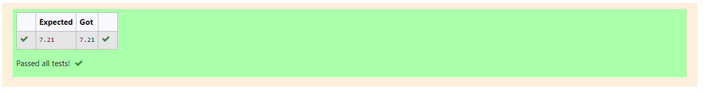

# DISTANCE-BETWEEN-TWO-POINTS

## AIM:
To write a python program to find the distance two 2 points
## ALGORITHM:
### Step 1:
Get the coordinates from the user.

### Step 2: 
Substitute the values in the distance formula  

### Step 3: 
Print the result(Distance between the points).

### Step 4: 
End of the program.

### PROGRAM:
~~~
import math
d2=[10,6]
d1=[4,2]
d=math.sqrt((d2[0]-d1[0])**2+(d2[1]-d1[1])**2)
print(format(d,".2f"))
~~~
  
### OUTPUT:

### RESULT:
Program finished successfully.
